# POZIBILITY : Unlock your pose, unlock your possibility

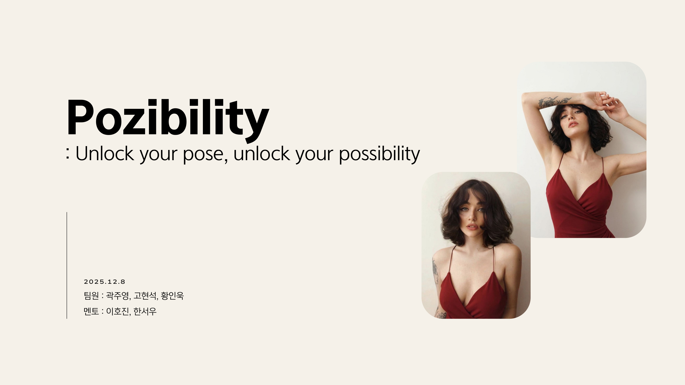

**AI 포즈 합성 서비스 POZIBILITY**는 *정적인 사진 경험을 더 동적이고 자신감 있는 경험으로 확장*하기 위해,
사용자의 원본 사진에 다른 사람의 역동적인 포즈를 자연스럽게 합성하는 2-Stage 이미지 생성 파이프라인을 제안합니다.

- 기간: 2025.12.08  
- 팀원: 곽주영, 고현석, 황인욱  
- 멘토: 이호진, 한서우  

---

## 목차
1. [프로젝트 소개](#프로젝트-소개)
2. [기획 의도](#기획-의도)
3. [서비스 흐름도](#서비스-흐름도)
4. [AI 흐름도](#ai-흐름도)
5. [시연 영상](#시연-영상)
6. [Problems & Solutions](#problems--solutions)
7. [최종 결과물](#최종-결과물)
8. [발전 방향](#발전-방향)
9. [Appendix: 1-Stage vs 2-Stage](#appendix-1-stage-vs-2-stage)

---

## 프로젝트 소개

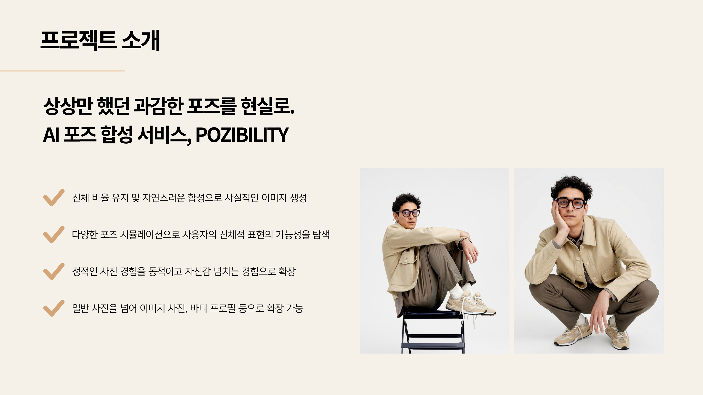

**목표**
- 신체 비율 유지 및 자연스러운 합성으로 *사실적인 이미지 생성*
- “상상만 했던 과감한 포즈”를 실제 사진으로 시뮬레이션
- 일반 사진을 넘어 이미지 사진, 바디 프로필 등으로 확장 가능

---

## 🧭 프로젝트 진행 과정 (요약)

최종 발표 자료에는 결과 중심으로 정리되어 있었지만, 실제 개발은 아래처럼 **주차별 실험 → 문제정의 → 파이프라인 고도화 → 모듈화/발표 정리** 순으로 진행되었습니다.

### 1주차 (W1) — 서비스 방향/기술 스택 결정 & 테스트 데이터 준비
- **웹(Web) MVP로 진행**(QR로 접속 → 업로드/촬영 → 결과 다운로드/공유) 방향 결정
- 서비스 흐름도/스토리보드 초안 작성, 입력 이미지 타입/난이도 정의
- 모델/기술 스택 리서치 시작(세그멘테이션/생성/포즈 관련 후보군 탐색)

### 3주차 (W3) — 1차 데모 실험: 세그멘테이션/키포인트/생성모델 조합 탐색
- 배경 제거/흰배경 조건에서의 생성 성공률 탐색
- OpenPose 기반 키포인트 추출 파이프라인(다량 처리) 정리 및 데모 테스트
- 나노바나나(후처리/수정) 데모에서 “키포인트가 깔끔할수록 결과가 좋아짐”을 확인

### 4주차 (W4) — Qwen 기반 1차 생성 파이프라인 구축 & 평가 체계화
- **Qwen(ComfyUI) 워크플로우를 코드로 이식**하고 AWS 인스턴스 기반 실험 환경 준비
- 정성 평가 템플릿/점수화 등 **평가 루틴**을 마련해 실험 결과를 누적 관리
- Qwen 결과(T-17 등)에서 발생하는 할루시네이션 유형을 분류/분석하고, 보강 방향을 정리
- ControlNet(depth/pose) 조합 실험 결과를 검토(한계 확인 포함)

### 5주차 (W5) — 2-Stage 확정: (Qwen 1차 생성) → (유저 피드백 기반 NB 2차 보정) + 전처리 고도화
- OpenPose 대비 **DW Pose**로 전환/정교화(얼굴/손 등 생성형 모델 친화성 고려)
- 전처리 고도화: 인체 비율/프레이밍(패딩) 문제를 케이스(전신/상반신) 기반으로 처리
- **Image Captioning 도입**으로 성별/배경/소품 등의 맥락 이탈(할루시네이션) 감소 확인
- 유저가 선택한 “수정할 할루시네이션 유형”에 따라 2차 프롬프트를 다르게 만드는 **동적 프롬프팅** 적용
- NBGenerator 형태로 2차 생성 모듈 인터페이스(입력 경로/옵션)를 정리해 실행/재현성을 확보
- 최종 발표 자료(PPT) 정리 및 데모 흐름 고정

### 팀 작업 방식 (짧은 정리)
- 초기에는 역할을 단순 분리했지만(프론트/백/AI), 실험 결과에 따라 **서로 교차 참여(cross-domain)** 하며 병렬로 문제를 풀었습니다.
- “실험 로그/회의록/디버깅 테이블”을 기반으로, 매주 의사결정과 기술 변경(예: OpenPose→DW Pose, 1-stage→2-stage)을 빠르게 반복했습니다.
## 기획 의도

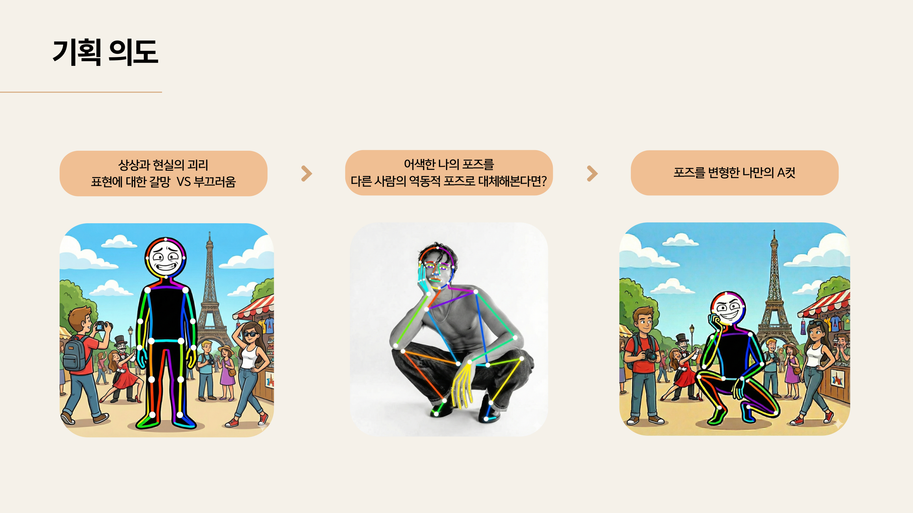

- **상상과 현실의 괴리**
- **표현에 대한 갈망 vs 부끄러움**
- 어색한 나의 포즈를 **다른 사람의 역동적 포즈로 대체**해보면?
- 결과: *포즈를 변형한 나만의 A컷*

---

## 서비스 흐름도

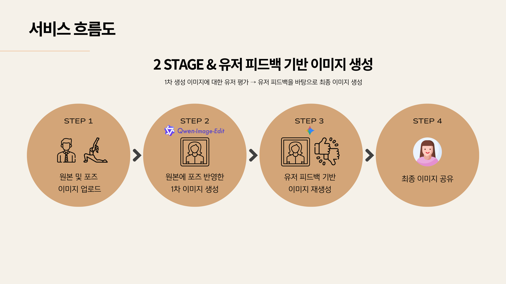

POZIBILITY는 2-Stage 생성 구조를 기반으로 합니다.

1. **원본 및 포즈 이미지 업로드**
2. **원본에 포즈를 반영한 1차 이미지 생성**
3. **유저 피드백 입력**
4. **피드백 기반 이미지 재생성 → 최종 이미지 공유**

---

## AI 흐름도

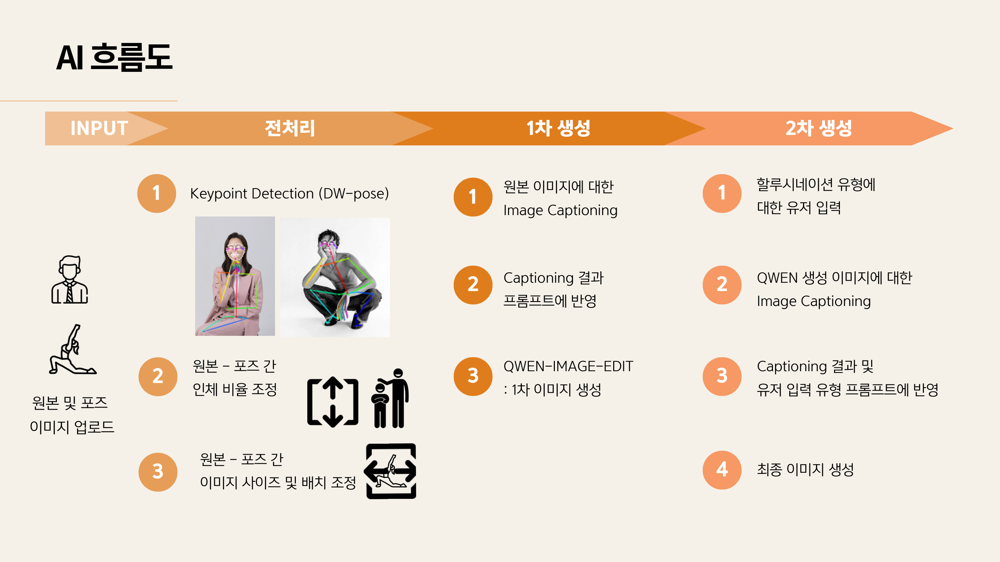

### Stage 1 (1차 생성)
- **Keypoint Detection (DW-pose)**  
- **Image Captioning**(원본 이미지 설명 추출) → 프롬프트에 반영  
- **QWEN-IMAGE-EDIT**로 1차 결과 생성

### Stage 2 (2차 생성)
- 1차 결과에서 발생한 **할루시네이션 유형**을 유저가 선택
- 선택된 유형 + Captioning 정보를 프롬프트에 반영
- **NanoBanana**(이미지 편집/정정 단계)로 최종 결과 생성

---

## 시연 영상

아래 링크에서 시연 영상을 확인할 수 있습니다.

- 시연 영상: https://drive.google.com/file/d/1TprIpIyO2AX0E3BqYp3gUCXVjPXla5s4/view?usp=drive_link

## Problems & Solutions

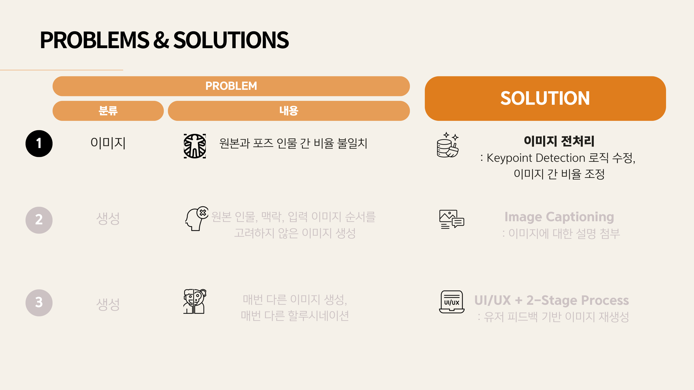

### Problem 1) 원본과 포즈 인물 간 비율 불일치  
✅ **해결**: 이미지 전처리(비율/배치 보정)

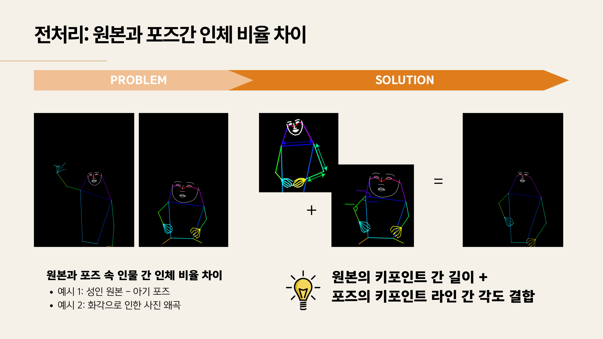

- 원본 키포인트 간 **길이 정보** + 포즈 키포인트 라인 간 **각도 정보**를 결합해 비율 차이를 줄였습니다.
- 예시: 성인 원본 + 아기 포즈 / 화각 왜곡 케이스 대응

### Problem 2) 원본 인물/맥락을 고려하지 않은 생성(배경/성별/도구 등 변형)  
✅ **해결**: Image Captioning으로 원본 정보를 프롬프트에 강제 반영

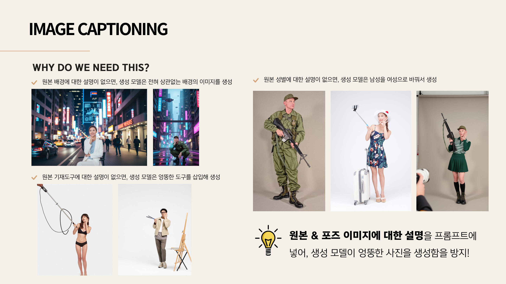

- 배경/성별/도구/의상 등의 정보를 누락하면 모델이 임의로 바꿔 생성하는 문제를 줄이기 위해,
  원본 및 포즈 이미지의 설명을 프롬프트에 포함했습니다.

### Problem 3) 매번 다른 생성 결과(할루시네이션 유형 이해/제어 어려움)  
✅ **해결**: UI/UX + 2-Stage Process(유저 피드백 기반 재생성)

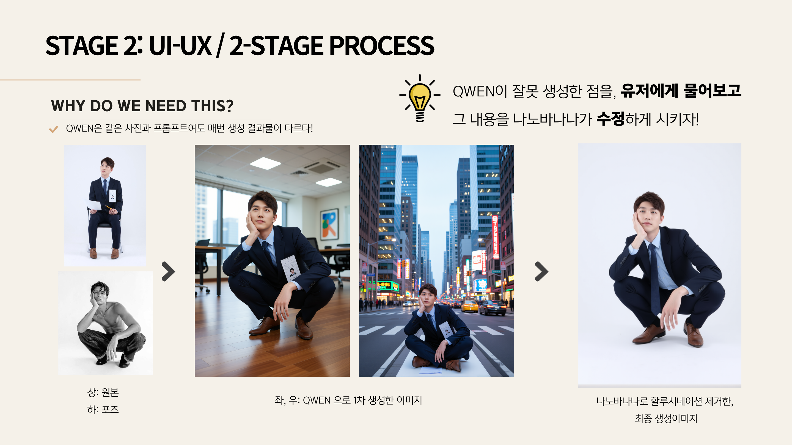
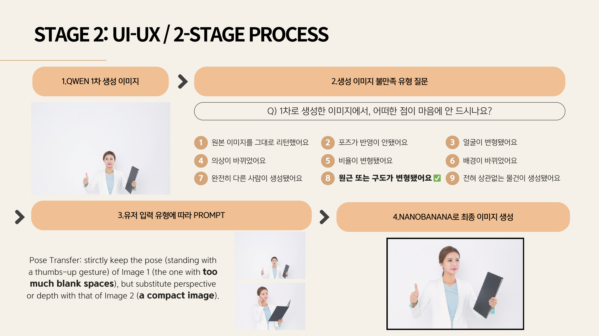

- 1차 생성 결과에서 사용자가 **불만족 유형(할루시네이션 유형)**을 선택
- 선택된 유형에 맞춰 프롬프트를 구성해 2차 생성에서 오류를 정정

---

## 최종 결과물

아래는 **원본 / 포즈 / 1차(QWEN) / 2차(NanoBanana)** 비교 예시입니다.

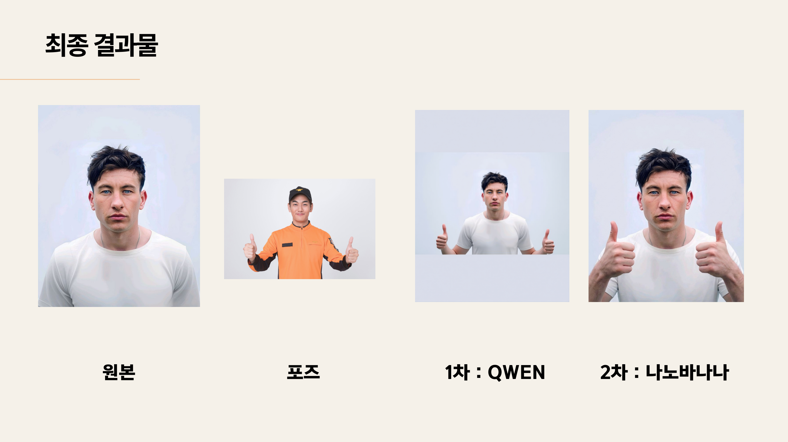
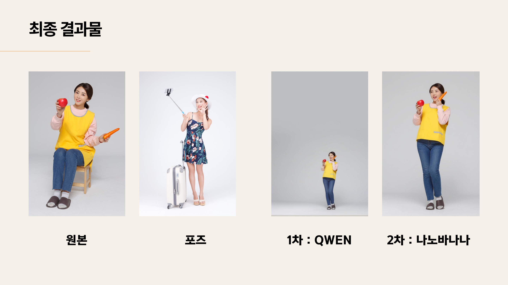

---

## 발전 방향

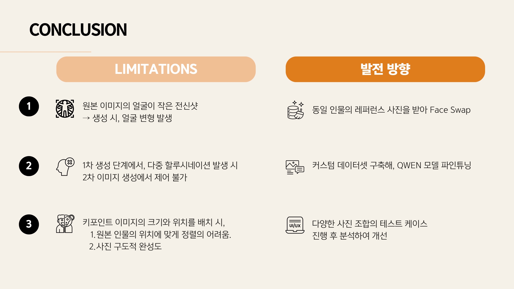

**Limitations**
1. **원본 얼굴이 작은 전신샷**에서 얼굴 변형 발생  
   - 개선: 동일 인물 레퍼런스 사진을 추가로 받아 **Face Swap** 또는 신원 유지 강화
2. **1차 생성에서 다중 할루시네이션 발생** 시 2차에서 완전 제어 어려움  
   - 개선: 커스텀 데이터셋 구축 후 **QWEN 파인튜닝**
3. 키포인트 이미지 배치 시 정렬 난이도 및 구도 완성도 이슈  
   - 개선: 다양한 사진 조합 테스트 케이스를 축적/분석해 규칙 개선

---

## Appendix: 1-Stage vs 2-Stage

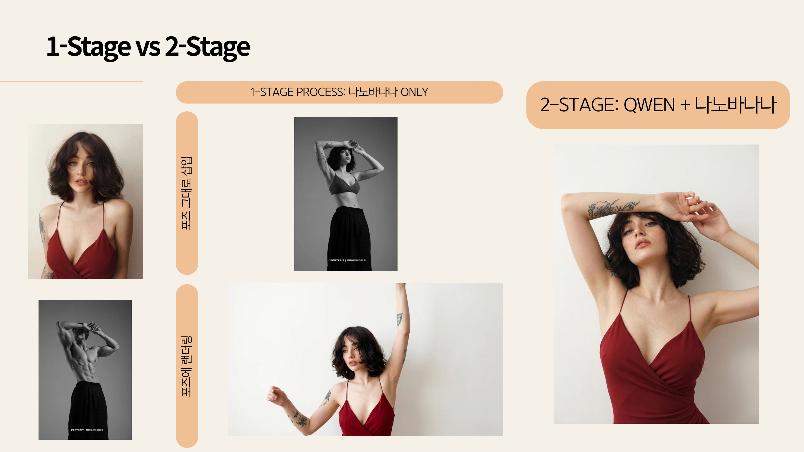

- **1-Stage(나노바나나 only)**: 포즈를 그대로 삽입(단, 원본 맥락/정체성 유지가 흔들릴 수 있음)
- **2-Stage(QWEN + 나노바나나)**: 1차에서 포즈 전이 기반 초안 생성 후, 2차에서 할루시네이션을 정정

### 실패 케이스(원본 얼굴이 작은 전신샷)

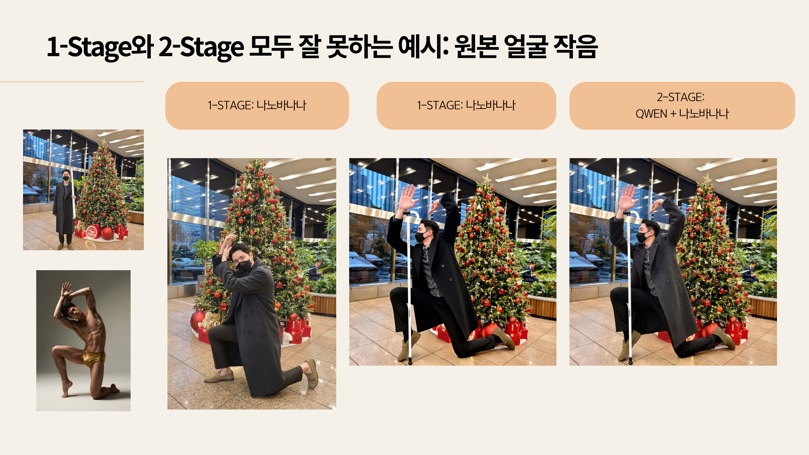

- 얼굴이 작을수록 정체성 유지가 어려워지는 문제가 있어,
  레퍼런스 기반 신원 유지(추가 얼굴 레퍼런스 입력) 전략이 필요합니다.

---

## 라이선스 / 저작권
- 본 리포지토리의 이미지/자료는 **프로젝트 발표용**으로 사용된 자료입니다.
- 외부 데이터/모델(예: DW-pose, Qwen 계열, Captioning 모델 등)의 라이선스는 각 프로젝트의 원 라이선스를 따릅니다.
